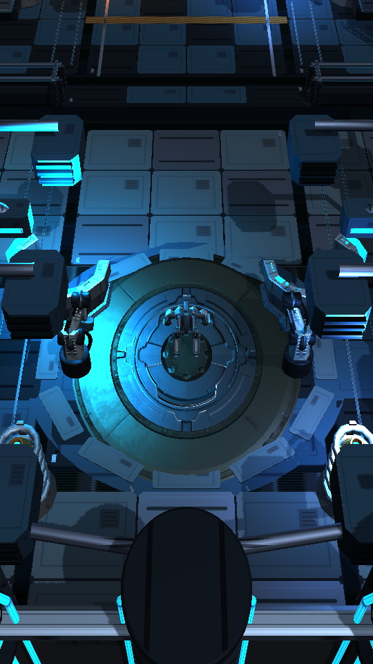
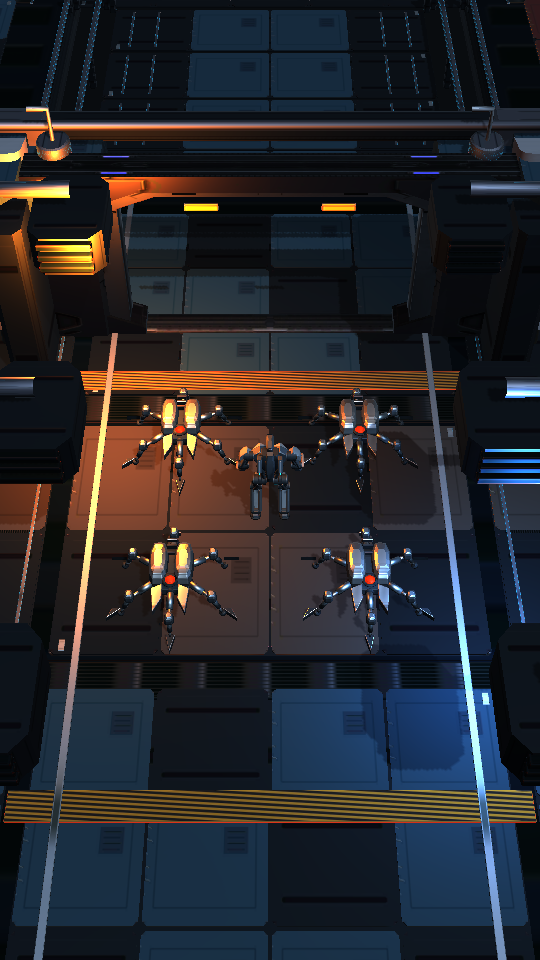
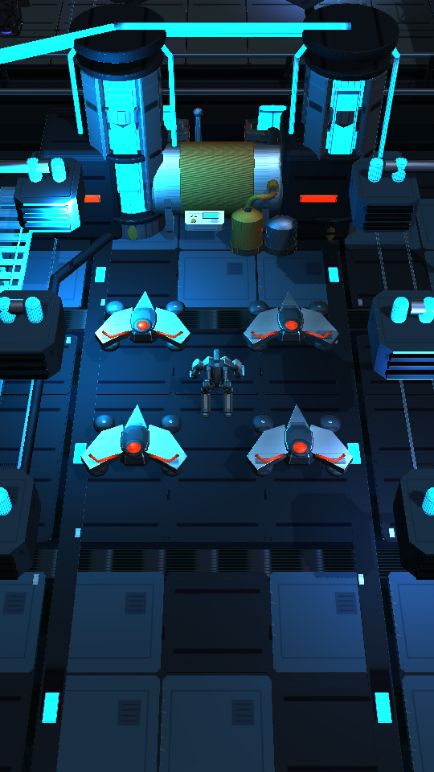
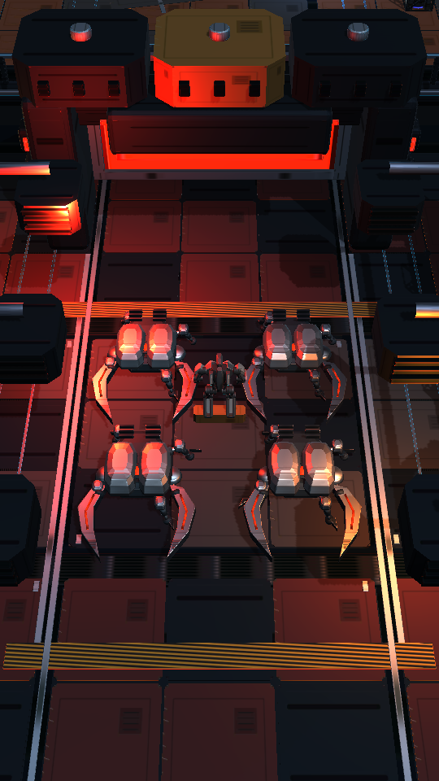
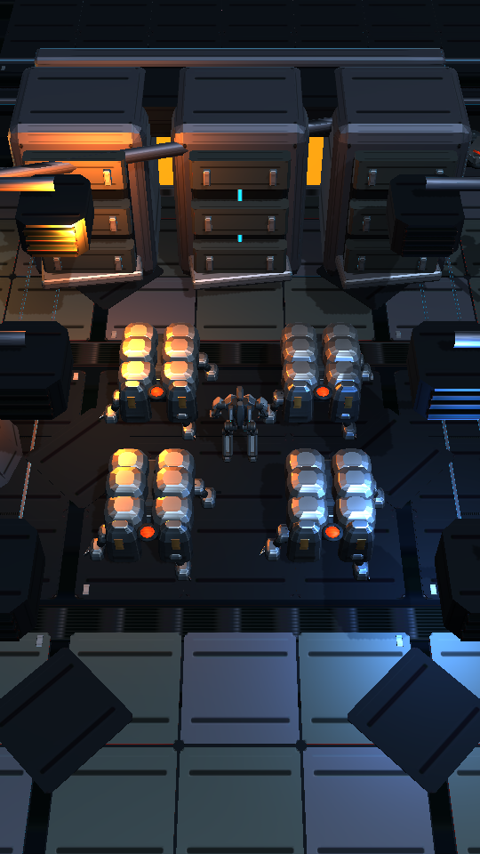
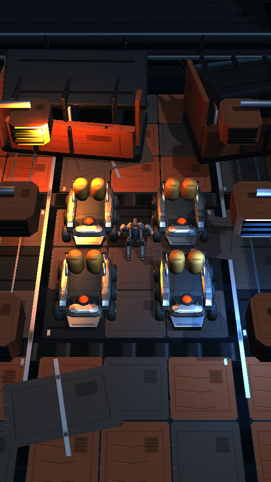
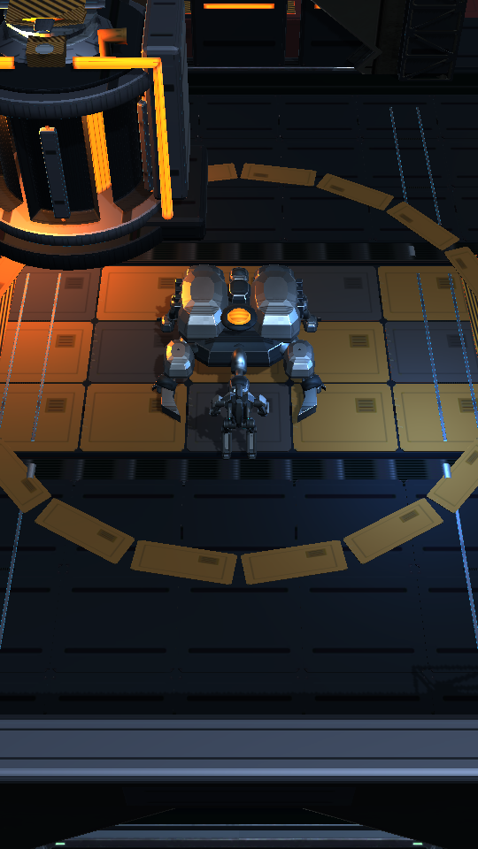
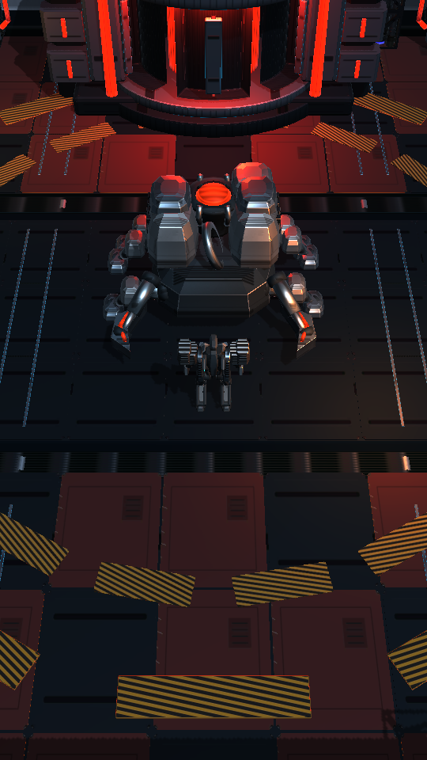

# Chapter 01 R2 — real portrait views without UI

Captured from the actual production follow camera before APK 49. Actor models and camera parameters are unchanged; Canvas visibility is temporarily disabled only for these screenshots. Owner device acceptance remains pending.

## Repair Hub

## Relay Yard

## Capacitor Field

## Cutting Floor

## Shield Dump

## Hauler Graveyard

## Magnetar Complex

## Custodian Core

